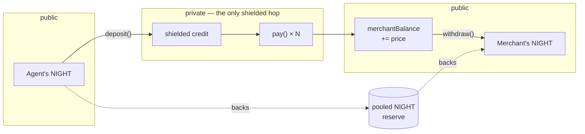
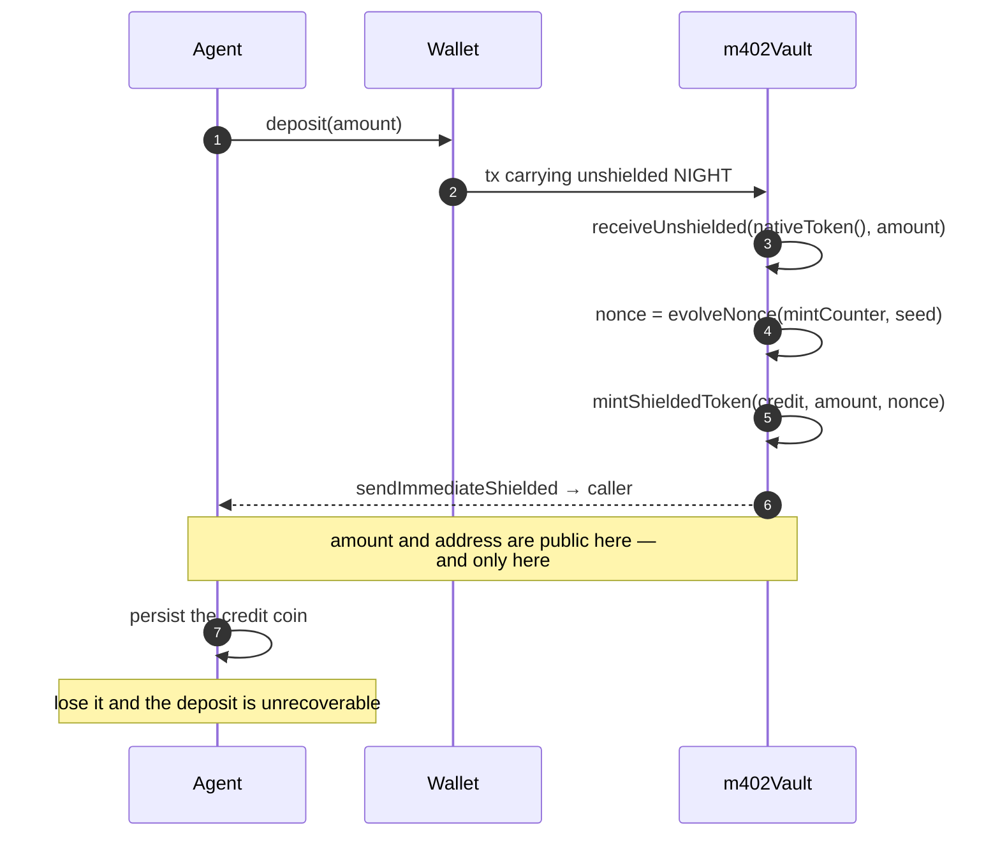
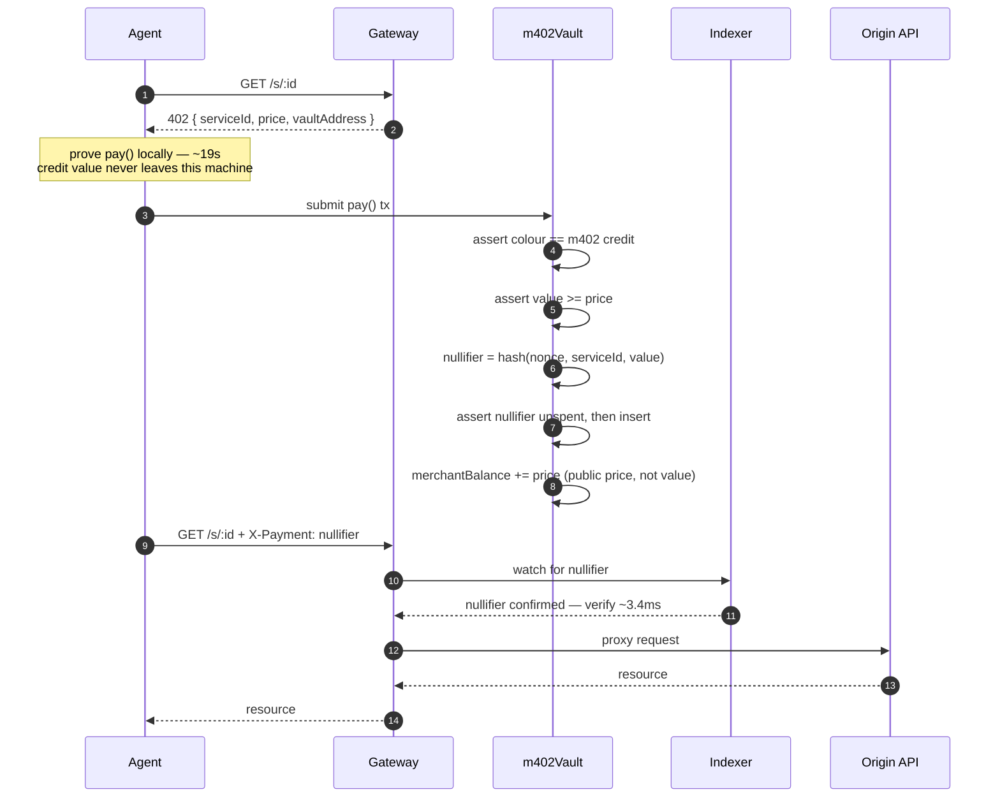
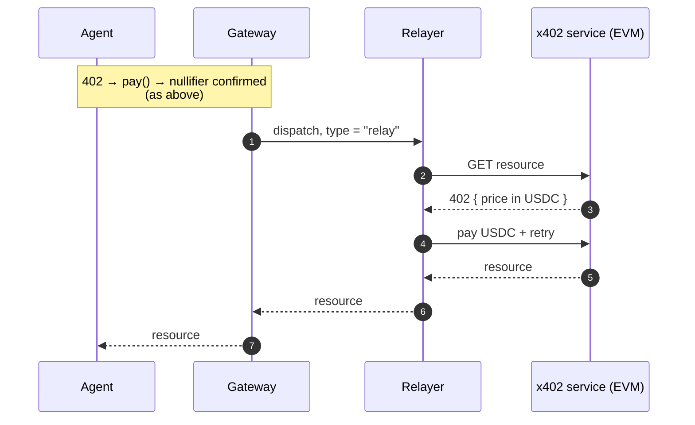
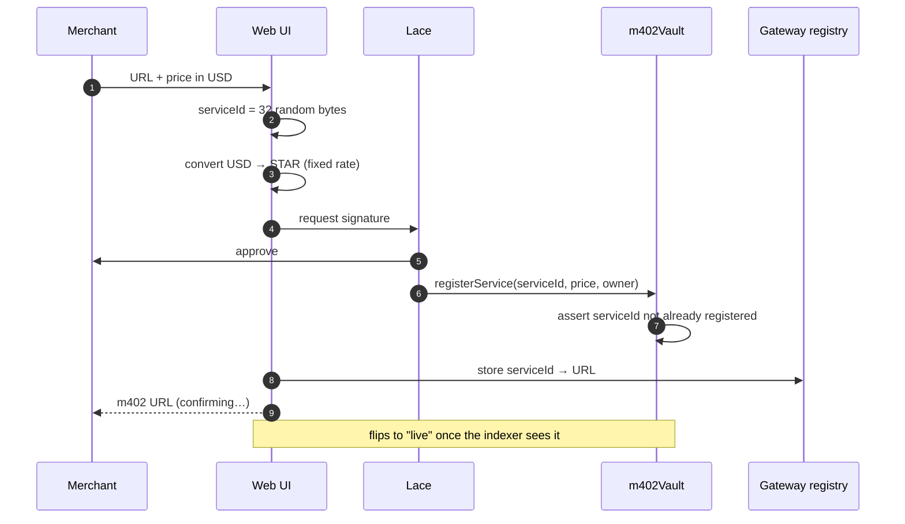
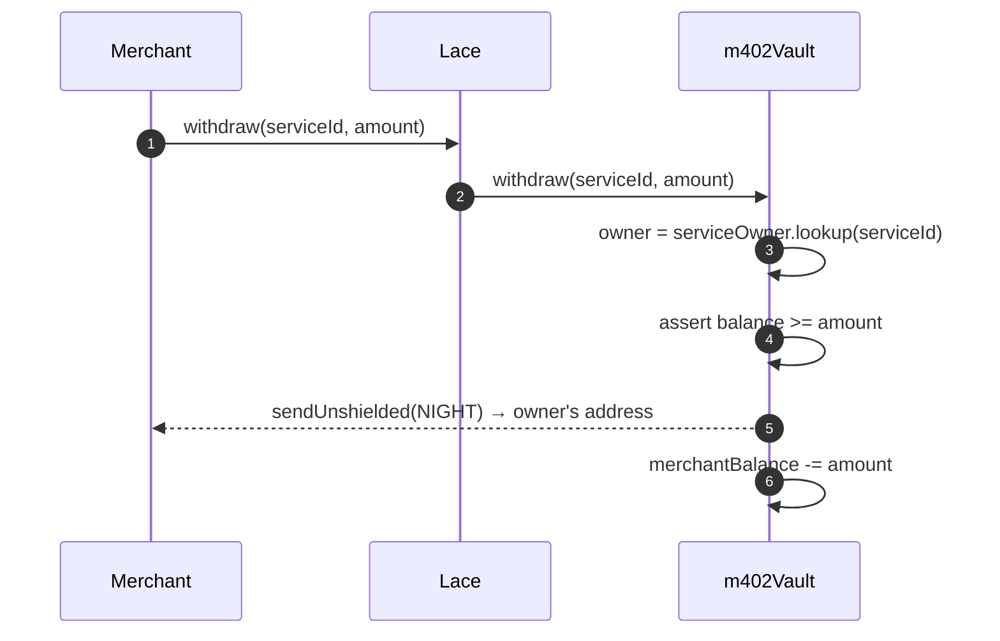
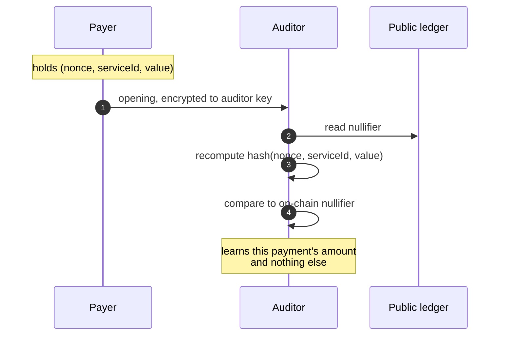
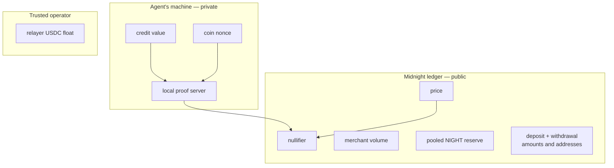

# Flow diagrams

Sequence and boundary diagrams for each operation. The contract they describe is
[`../../contracts/src/m402Vault.compact`](../../contracts/src/m402Vault.compact); the
reasoning behind the shapes is in [`../design.md`](../design.md).

## Value lifecycle

Where money enters, moves, and leaves. **NIGHT is unshielded**, so it cannot be spent
privately — the vault pools it and issues a shielded credit against it 1:1. Privacy lives
entirely in the middle step.

The reserve's balance is public, but it moves **only** on deposit and withdrawal — never on
payment. That is what stops payment amounts being recovered by differencing it.

## Deposit

Once per top-up, not per call. Unshielded NIGHT in, shielded credit out.

Merchants use Lace; the agent CLI uses a headless wallet. Both take this same path.

## Payment — native service

The colour assert is not optional: `receiveShielded` does not check what token it receives,
so without it any minted token would buy API calls.

## Payment — relayed x402 service

Identical up to verification. Only fulfilment differs.

## Registration

`owner` is the merchant's unshielded Lace address — it is the payout destination, so no
merchant secret exists. Registration is first-come and immutable; without that guard anyone
could re-register a `serviceId` and redirect its revenue.

## Withdrawal

The payout address is read from the ledger, so no caller authentication is needed and the
funds can only reach the registered merchant.

`sendUnshielded` takes a `UserAddress` and has no coin-ciphertext restriction, so the vault
can pay any address rather than only its caller. No pot coin and no change coin to track.

## Selective disclosure

No on-chain step and no additional circuit. The nullifier already commits to the payment.

## Trust boundaries

`value` and `nonce` never leave the agent's machine, and the ledger records only that a
payment of at least `price` occurred.

Deposits and withdrawals sit **outside** that boundary: both amount and address are public.
This is inherent to backing a shielded credit with an unshielded reserve, and is the trade
every shielded pool makes. Full list in [`../roadmap.md`](../roadmap.md#known-limitations).
