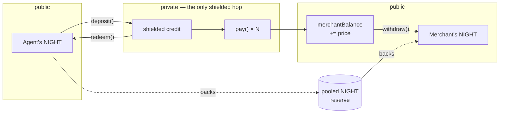
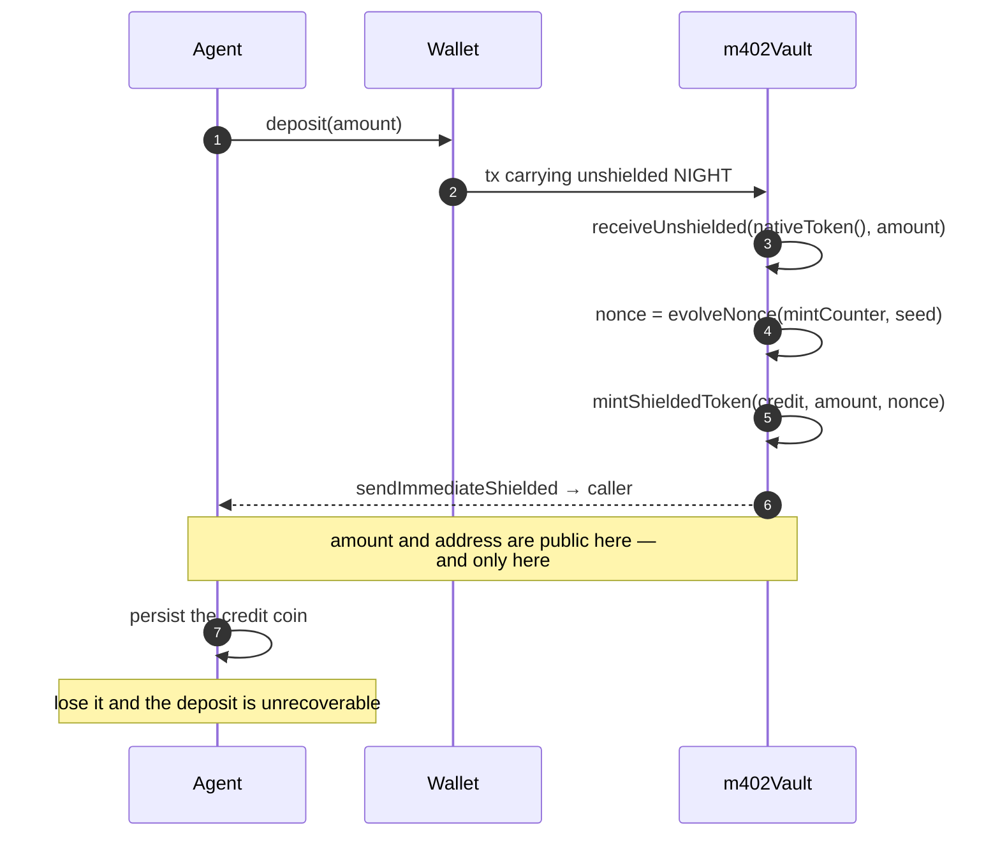
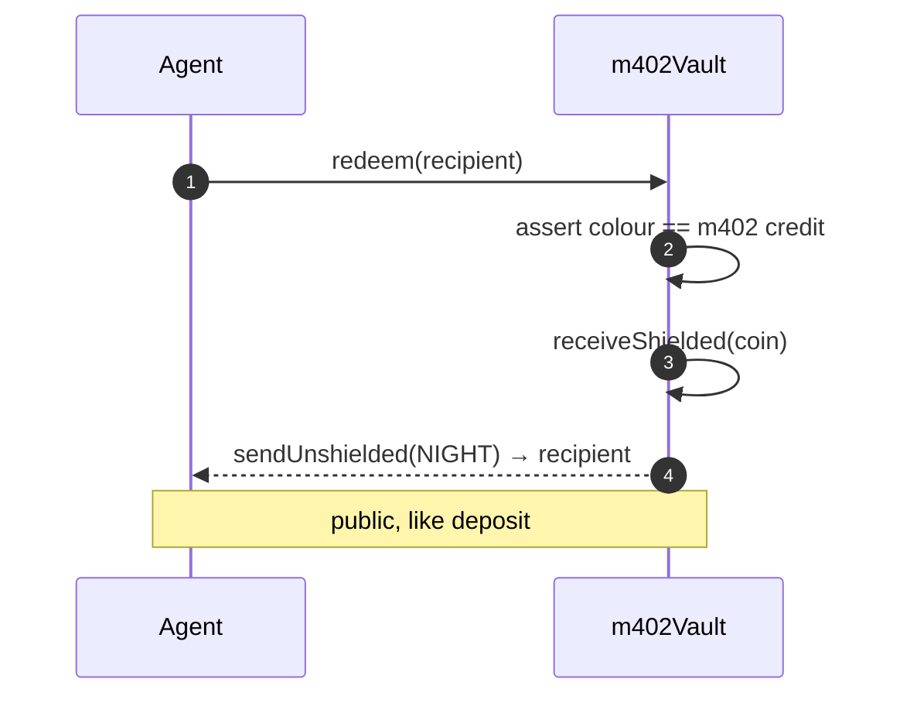
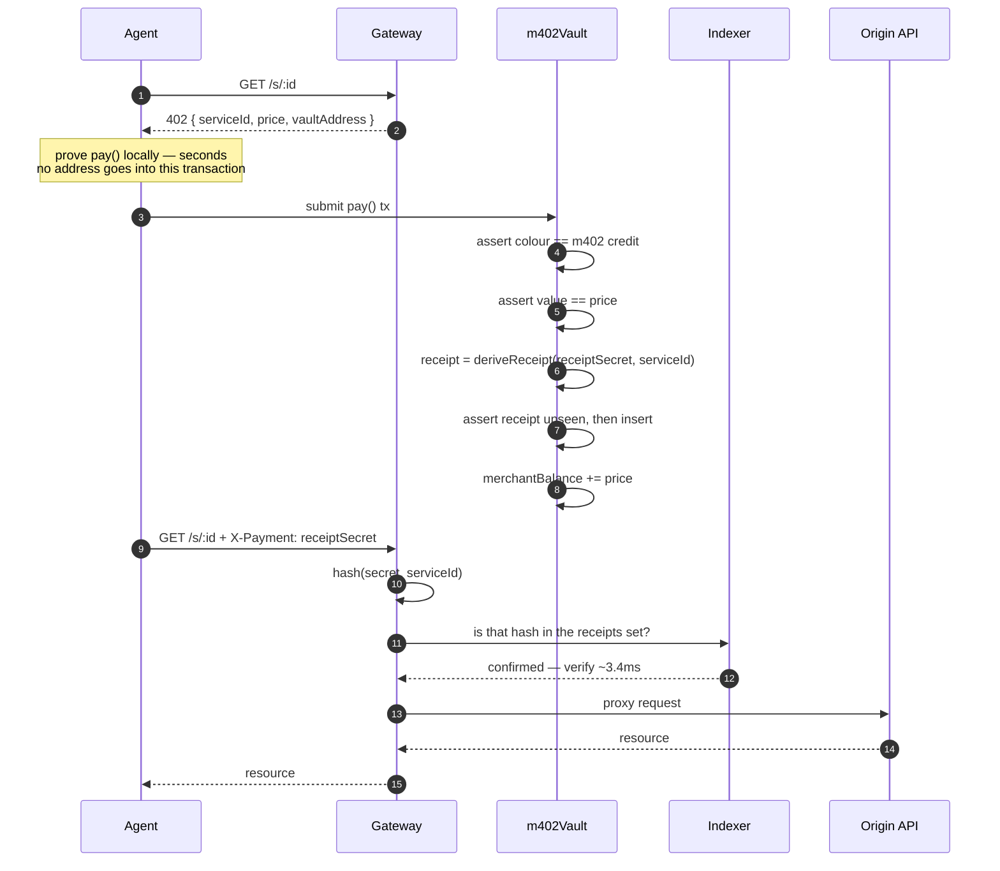
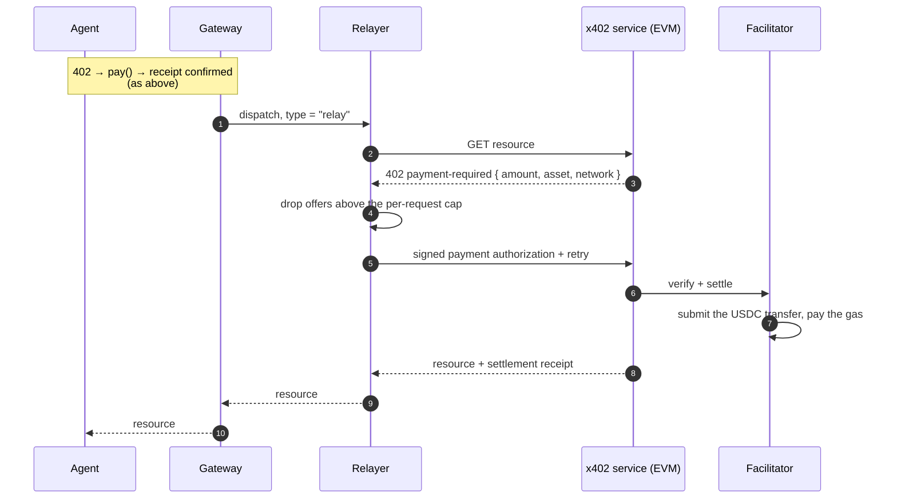
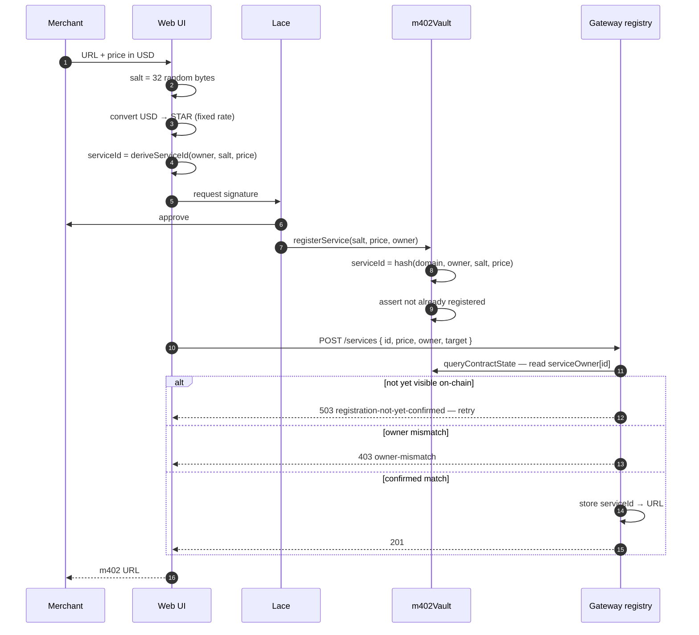
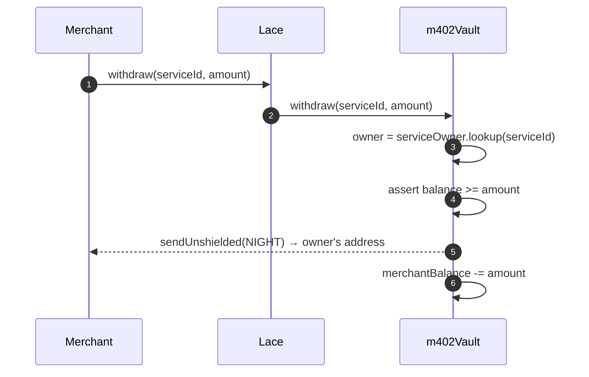
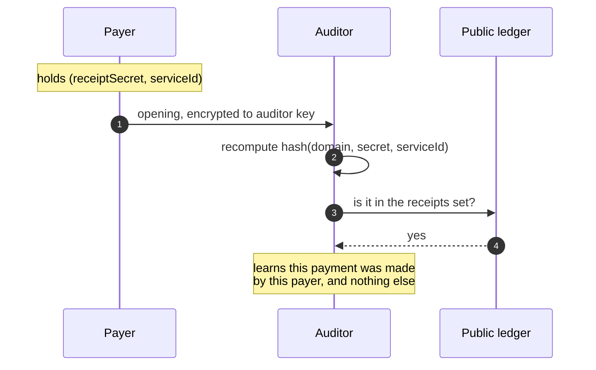
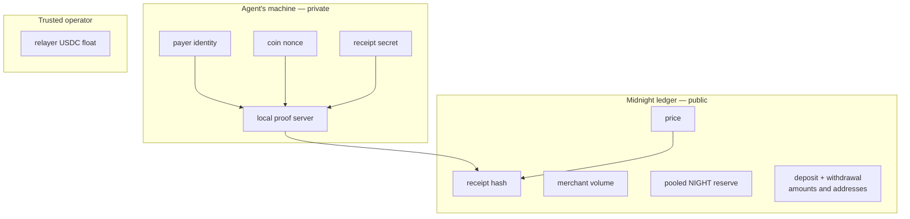

# Flow diagrams

Sequence and boundary diagrams for each operation. The contract they describe is
[`../../contracts/src/m402Vault.compact`](../../contracts/src/m402Vault.compact); the
reasoning behind the shapes is in [`../design.md`](../design.md).

## Value lifecycle

Where money enters, moves, and leaves. **NIGHT is unshielded**, so spending it reveals the
sender — the vault pools it and issues a shielded credit against it 1:1. The payer is
anonymous only in the middle step.

Deposits and redemptions are signed by an address; payments are not. An agent's NIGHT going
in and a merchant's NIGHT coming out are both public — what is unlinkable is which agent
triggered which call in between.

## Deposit

Once per top-up, not per call. Unshielded NIGHT in, shielded credit out.

Merchants use Lace; the agent CLI uses a headless wallet. Both take this same path.

## Redeem

The reverse of deposit: burn credit, get NIGHT back. Holding the coin is the authorisation.

## Payment — native service

Two things here are not optional. The **colour assert** — `receiveShielded` does not check
what token it receives, so without it any minted token would buy API calls. And the
**receipt**: only `deriveReceipt(secret, serviceId)` is published, so an observer watching
the indexer cannot lift a redemption credential off the chain.

The amount is `==`, not `>=`. `pay` consumes the whole coin but credits only `price`, so an
overpaying coin would burn the difference.

The gateway checks one more thing the diagram omits: before dispatching, it also checks the
hash against a **local** consumed-receipts table. `receipts` is append-only — it proves a
payment happened, never that this particular access grant is still unspent — so that second
check is the gateway's own replay guard, not something the chain can enforce for it.

## Payment — relayed x402 service

Identical up to verification. Only fulfilment differs.

The relayer signs an authorization; the **facilitator** submits the transfer and pays the gas.
The relayer therefore needs USDC but no native ETH. The settlement receipt returned with the
resource carries the transaction hash, which is the only evidence that value actually moved —
a `200` alone does not distinguish a settled call from a server that skipped settlement.

## Registration

`owner` is the merchant's unshielded Lace address — it is the payout destination, so no
merchant secret exists. Deriving `serviceId` from `owner` is what defeats front-running: an
observer who copies this transaction and substitutes their own address produces a *different*
id and cannot capture the merchant's.

`price` is bound into the id for the same reason, so the conversion to STAR must happen
**before** the id is derived. Every argument of a pending registration is public. While the
id bound only the owner, an observer could copy the owner and salt, set `price` to 1, and win
the race — leaving the merchant with a service permanently priced at 1.

The gateway's registry entry is not optimistic. `POST /services` is a separate, off-chain call
— the contract never stores a URL — and the gateway does not take its body on faith: it reads
`serviceOwner[id]` back from the chain first and only stores the mapping once that matches.
There is no unconfirmed "confirming…" state to badge; the web UI retries the `503` until the
`registerService` transaction has actually landed.

## Withdrawal

The payout address is read from the ledger, so no caller authentication is needed and the
funds can only reach the registered merchant.

`sendUnshielded` takes a `UserAddress` and has no coin-ciphertext restriction, so the vault
can pay any address rather than only its caller. No pot coin and no change coin to track.

## Selective disclosure

No extra circuit. The `receipts` set already holds a commitment to each purchase.

## Trust boundaries

**No address appears in a payment.** `pay` takes no payer argument and reads no caller
identity, so the ledger records that *someone* holding a valid credit paid — and two payments
by the same agent cannot be linked.

The amount is **not** hidden: it equals the published `price`. Deposits, redemptions and
withdrawals sit outside the boundary entirely, public in amount and address. Both are
inherent to backing a shielded credit with an unshielded reserve. Full list in
[`../roadmap.md`](../roadmap.md#known-limitations).
