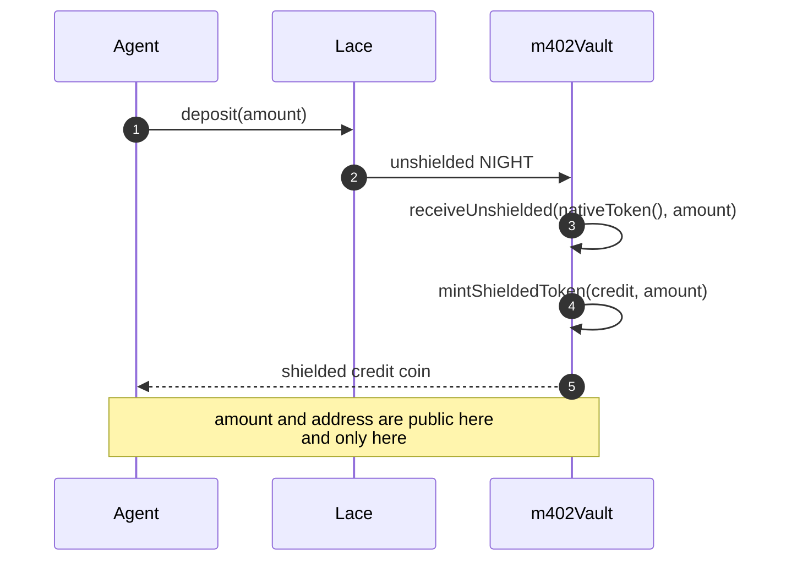
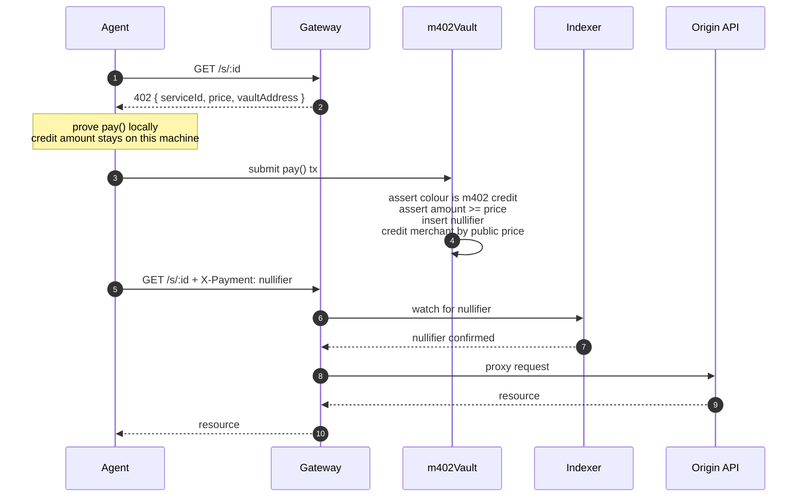
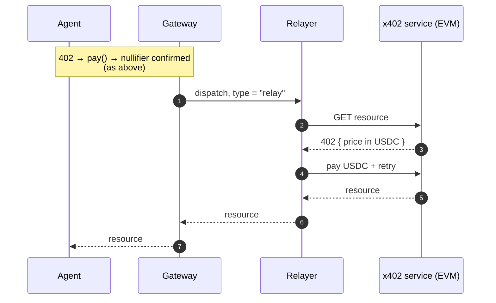
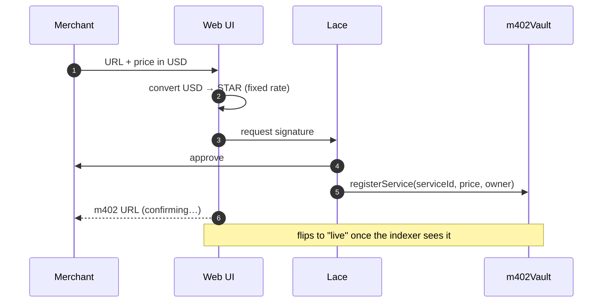
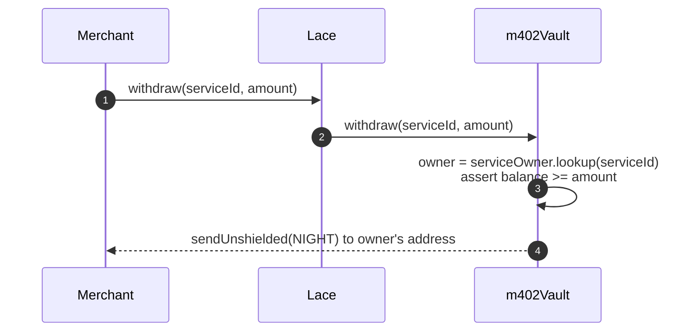
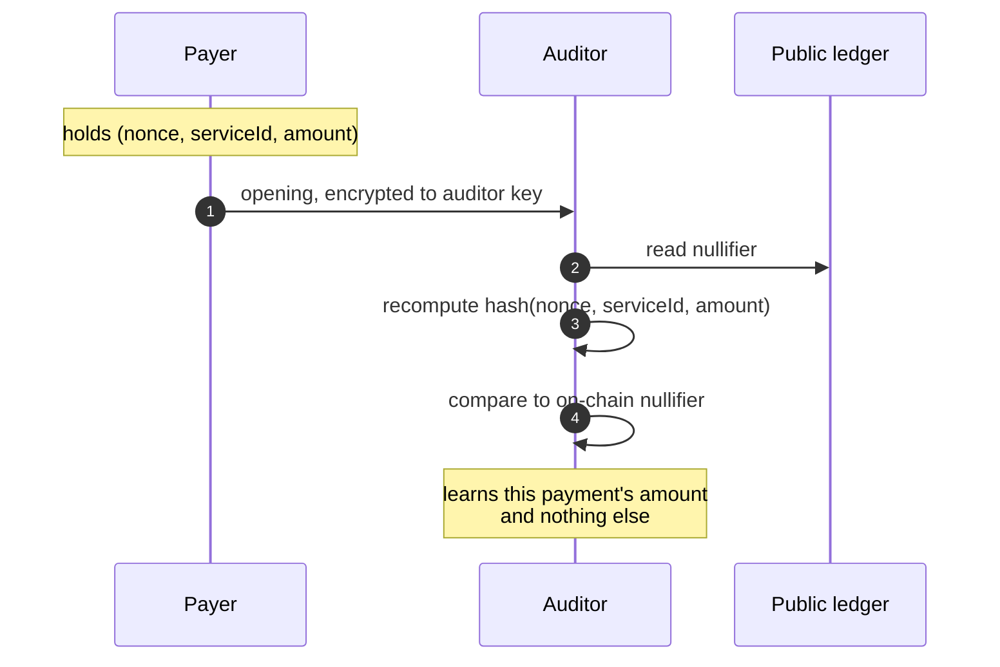
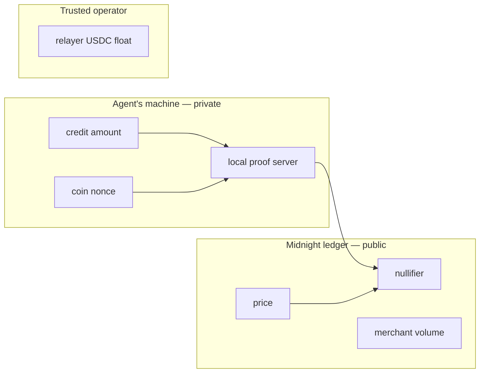

# Flow diagrams

## Deposit

Public by nature: unshielded NIGHT in, shielded credit out. Done once, not per call.

## Payment — native service

## Payment — relayed x402 service

Identical up to verification. Only fulfilment differs.

## Registration

## Withdrawal

The payout address is read from the ledger, so no caller authentication is needed and the
funds can only reach the registered merchant.

## Selective disclosure

No on-chain step and no additional circuit. The nullifier already commits to the payment.

## Trust boundaries

`amount` and `nonce` never leave the agent's machine. The ledger records only that a payment
of at least `price` occurred. Deposits and withdrawals sit outside this boundary and are
public.
